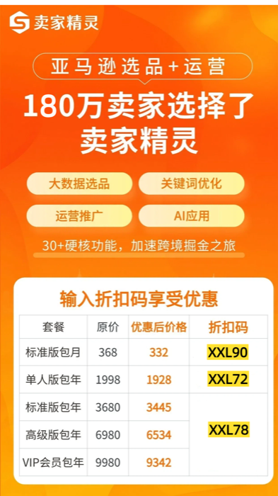
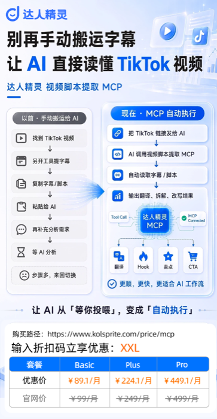

English | [简体中文](README.md)

<div align="center">


# 🎯 tk-content-fit

**Translate an Amazon hit-product Listing into a TikTok content strategy — validate whether it's worth doing across four dimensions**

**For the latest AI industry trends, AI × e-commerce / advertising playbooks, and thinking on human-AI collaboration, follow the WeChat Official Account: 【新西楼.AI】**


[](LICENSE)
[](https://docs.anthropic.com/en/docs/claude-code)
[]()

**Zero-Dependency · 4-Dimension Validation · Layered Decisions · User at the Wheel**

**Created By Buluu@新西楼.AI**

</div>

## Overview

A general-purpose Agent Skill: feed it an Amazon hit-product Listing, get back a feasibility verdict on TikTok content promotion — plus content directions, a creator profile, and a minimum test plan.

- **Agent-native**: works with any agent (Claude Code / Codex / Cursor, etc.) — install and run the 6-step flow
- **4-dimension validation**: product demand / content demonstrability / content competition / creator accessibility, judged layer by layer from this search's results
- **Zero-dependency**: runs fully on manual input with no MCP installed; auto-fetches when KOLSprite / SellerSprite MCP is configured (both paths are first-class)
- **User at the wheel**: every layer emits a "layer summary card" so you decide stop / go — the skill only gives evidence and recommendations, never decides for you

## ✨ What it does

Turns "is this Amazon hit worth taking to TikTok?" into an actionable 4-dimension verdict + plan:

| Capability | Description |
|---|---|
| Listing → TK translation | Translate Amazon title keywords into localized search terms (6 word types + a recall-quality check loop) |
| 4-dimension validation | Product demand / content demonstrability / content competition / creator accessibility, sampled across L1/L2/L3 |
| Verdict tiering | Worth testing / Conditionally worth testing / Insufficient evidence (distinguishes "weak signal after testing" from "not yet tested enough") |
| Opportunity typing | Category dividend / Differentiation / Content-driven / Creator-leverage — main + secondary hooks |
| Content directions | ≥3 priority directions + not-recommended ones (+ script skeleton if L3 runs) |
| Creator profile | Reference group + first-round collaboration group (hard constraint: only list creators with contact info) |
| Minimum test plan | Auto-proportioned by opportunity type (angle × creator × cycle + scale-up / stop criteria) |

**6-step flow**: Pre-screen → Demand anchoring → Translation → 3-layer validation → Verdict & typing → Plan customization

## 🚫 What it does NOT do

- ❌ No cost / margin / commission / inventory / ads / conversion diagnostics (only validates content-promotion feasibility)
- ❌ No go/no-go decisions (you decide — the skill only gives evidence and advice)
- ❌ No whole-market claims (numbers are based on this search's results, not the entire TK market)
- ❌ Does not generate the video itself (output is content direction + creators + test plan, not a video file)

## 🚀 Quick Start

**Install** (Claude Code skills path; Codex / Cursor users: feed SKILL.md to your agent as instructions):

```bash
# User-level (available across all projects)
git clone https://github.com/buluslan/tk-content-fit.git ~/.claude/skills/tk-content-fit
```

**Minimal input example**:

```
Validate this Amazon hit for TikTok: https://www.amazon.com/dp/B0XXXXXXXX
```

The agent will ask follow-ups (target market / competitors / known TK info), or you can give everything at once per the "Input" section of SKILL.md to skip the back-and-forth. After each layer you get a "layer summary card" — stop or continue, your call.

## Three Iron Rules

1. **Data is replaceable** — every module has two paths (MCP auto-fetch / manual fill); paid data sources are optional enhancements, no membership required to run
2. **Layered unfolding** — shallow → deep, each layer is a decision point; the priciest step (L3 caption teardown) stays off by default, buried deepest
3. **User at the wheel** — key decisions (early-stop / continue, how deep, go/no-go) give advice but the call is yours

## Workflow skeleton (steps 0–5)

| Step | What | Details |
|------|------|---------|
| 0 Pre-screen | Category traits + shootability first-pass | [`references/listing-frontload.md`](references/listing-frontload.md) §0 |
| 1 Demand anchoring | Listing → product understanding card | same §1 |
| 2 Translation | Amazon keywords → TK localized search terms (with recall check) | same §2 |
| 3 3-layer validation | L1 existence → L2 competition & creators → L3 script (optional) | [`references/tk-validation.md`](references/tk-validation.md) |
| 4 Verdict & typing | 4-dimension read + tier + opportunity type | same §4 |
| 5 Plan customization | Content direction + creator profile + test plan | [`references/output-blueprint.md`](references/output-blueprint.md) |

## Data sources

**Recommended: connect the [KOLSprite](https://kolsprite.com) + [SellerSprite](https://sellersprite.com) MCP** — fuller, more accurate data; the skill ships with a complete fetch SOP. **Fully runnable without them** (zero-dependency, all manual).

| Side | MCP auto-fetch (recommended) | Manual (zero-dependency) |
|------|------------------------------|--------------------------|
| **Amazon** | SellerSprite: Listing details + sales/BSR forecast + competitors + reviews (UGC clustering) | Listing URL / title+bullets / screenshot (**required input**) + your own data |
| **TikTok** | KOLSprite: products / videos / creators / shops / captions | TK similar links + your own captions |

> The Amazon Listing is the skill's **primary input**, required whether or not MCP is connected. To configure MCP: buy a plan on KOLSprite / SellerSprite, get the secret-key, and write it into Claude Code's `.mcp.json` (params / fields / billing rules in [`references/mcp-reference.md`](references/mcp-reference.md)).

## 🎁 Sign-up Perks

Use these creator-exclusive discount codes when subscribing to the two MCP data sources (paste the code in the "coupon" field at checkout):

| Tool | Code | Discount | Link |
|------|------|----------|------|
| SellerSprite · Membership | `XXL90` (monthly) / `XXL72` (individual annual) / `XXL78` (standard/advanced/VIP annual) | See site per plan | [sellersprite.com/cn/price](https://www.sellersprite.com/cn/price) |
| SellerSprite · MCP | `XXL` | 10% off | [open.sellersprite.com/pricing/mcp](https://open.sellersprite.com/pricing/mcp) |
| KOLSprite · Membership + MCP | `XXL` | 10% off | [kolsprite.com/price](https://www.kolsprite.com/price) |

> KOLSprite also offers a **7-day free trial**: [kolsprite.com/?utm_source=XXL](https://www.kolsprite.com/?utm_source=XXL)

<div align="center">

 

</div>

> 🎯 These are exclusive perks from the **MBG 跨境AI实战圈** community — cross-border practitioners welcome. **Community intro: [mp.weixin.qq.com/s/dOz4fLmRnaFR7sD_TQm00Q](https://mp.weixin.qq.com/s/dOz4fLmRnaFR7sD_TQm00Q)**

## 📁 Structure

```
tk-content-fit/
├── SKILL.md                      # Heart: routing + general rules + 0-5 step skeleton
├── LICENSE                       # MIT
├── README.md                     # Chinese readme
├── assets/
│   ├── banner.png                # README banner
│   ├── ss_price.png              # SellerSprite discount
│   └── kol_price.png             # KOLSprite discount
└── references/
    ├── listing-frontload.md      # Steps 0-2: pre-screen / demand anchoring / translation
    ├── tk-validation.md          # Steps 3-4: 3-layer validation + verdict
    ├── output-blueprint.md       # Step 5: the three deliverables
    └── mcp-reference.md          # MCP tool call manual (read only if MCP is configured)
```

## 📜 License

[MIT](LICENSE) · Copyright (c) 2026 Buluu@新西楼.AI

## 📖 One more thing

<div align="center">

**If this tool helped you, a ⭐ Star means a lot. For more AI × cross-border e-commerce playbooks, follow the WeChat Official Account 「新西楼.AI」.**

</div>
